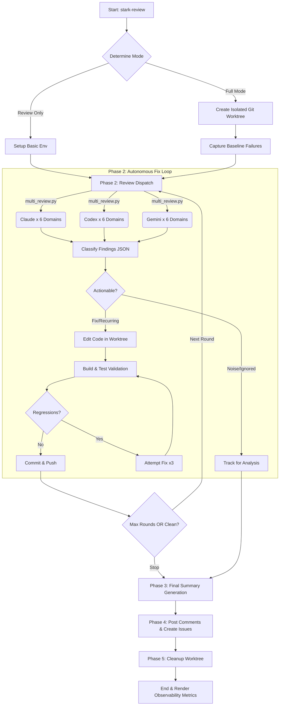

# stark-review — Internals

Multi-agent PR code review using 3 LLMs × N domains with autonomous fix loop. Use when the user says "stark review", "review this PR with all agents", "multi-agent review", or invokes /stark-review. Also triggers on `/stark-review` or `/stark-review <number>`.

## Architecture

## Phases

*See SKILL.md*

## Config

*No config*

## Failure Modes

*See SKILL.md*

## How to Modify This Skill

Edit `skill/stark-review/SKILL.md`, then run `/stark-generate-docs --skill stark-review` to regenerate documentation.
