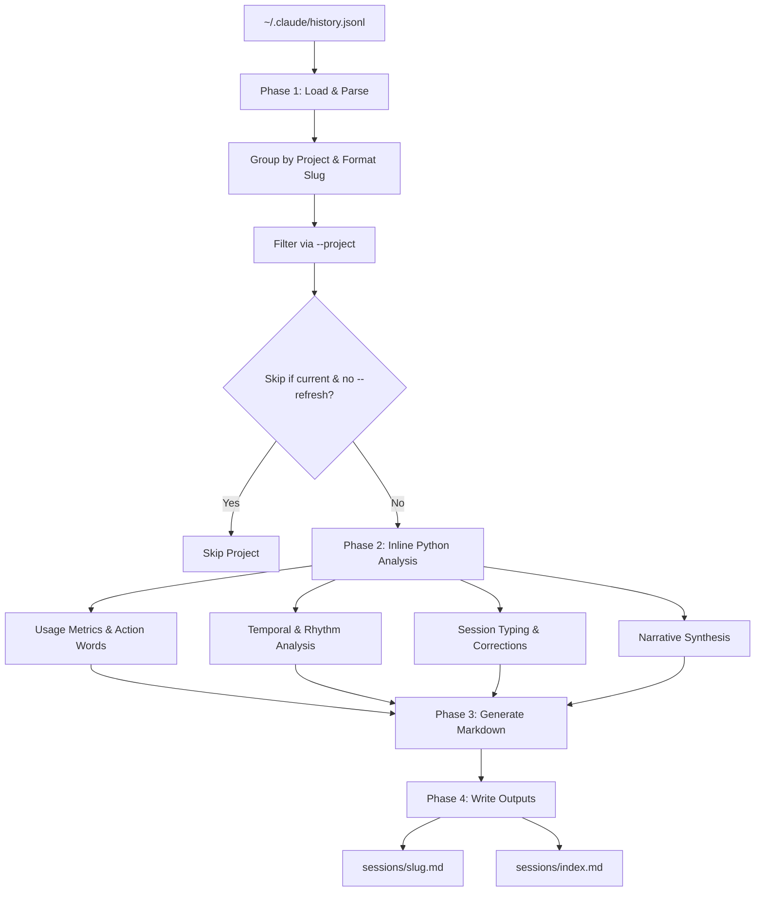

# stark-session-insights — Internals

Analyze Claude Code session history to extract usage patterns, skill invocations, action frequencies, corrections, and preferences — grouped by project. Reads ~/.claude/history.jsonl and generates per-project insight files. Use when the user says "session insights", "analyze sessions", "usage patterns", "what do I do most", or invokes /stark-session-insights.

## Architecture

## Phases

*See SKILL.md*

## Config

*No config*

## Failure Modes

*See SKILL.md*

## How to Modify This Skill

Edit `skill/stark-session-insights/SKILL.md`, then run `/stark-generate-docs --skill stark-session-insights` to regenerate documentation.
