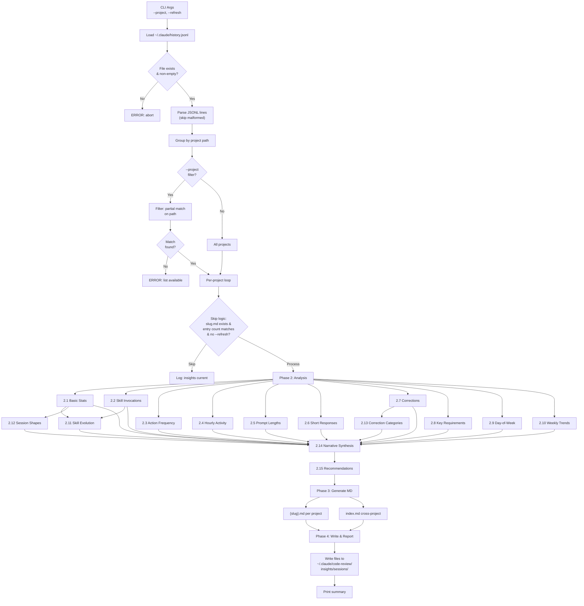

# stark-session-insights — Internals

Analyze Claude Code session history to extract usage patterns, skill invocations, action frequencies, corrections, and preferences — grouped by project. Reads ~/.claude/history.jsonl and generates per-project insight files. Use when the user says "session insights", "analyze sessions", "usage patterns", "what do I do most", or invokes /stark-session-insights.

## Architecture

![Internals documentation for stark-session-insights showing a vertical execution pipeline flowing through argument parsing, JSONL loading with validation gates, project filtering with skip logic, a 15-sub-analyzer engine (with dependency graph showing independent analyzers 2.1–2.10 feeding into dependent analyzers 2.11–2.13, then narrative synthesis 2.14 and recommendations 2.15), markdown generation, and file writing. Includes detailed tables of analyzer inputs/outputs/dependencies, session type classifier definitions, correction detection patterns, seven constants with their values and locations, six numbered extension points for contributors, three failure mode cards (hard failures, soft failures, degenerate inputs), and three safety boundary cards (read-only input, local-only output, no sensitive analysis). Uses the Stark Skills design system with blue phase nodes, purple decision nodes, green config nodes, amber output nodes, and red failure nodes.](internals.png)

## Phases

Phase 1 (Load & Parse): Reads ~/.claude/history.jsonl, parses each JSON line extracting display, timestamp, project, and sessionId fields. Malformed lines are skipped with a warning count. Entries are grouped by project path, with short names derived from the last two path segments. If --project is specified, a case-insensitive partial match filters to matching projects. Skip logic checks if a {slug}.md output file already exists with a matching entry count — if so, the project is skipped unless --refresh is passed.

Phase 2 (Analysis): Runs 15 sub-analyzers per project. Analyzers 2.1–2.10 are independent: basic stats, skill/command invocations, action word frequency, hourly activity distribution, prompt length bucketing, common short responses, correction detection, key long-prompt extraction, day-of-week distribution, and weekly trends. Analyzer 2.11 (skill evolution) compares first-half vs second-half skill usage (gated on >2 weeks of data). Analyzer 2.12 classifies session shapes by first/last prompts and dominant action patterns. Analyzer 2.13 categorizes corrections from 2.7 into data/logic, UX/direction, process/workflow, and frustration. Analyzer 2.14 synthesizes all prior results into a 3–5 paragraph narrative. Analyzer 2.15 generates 3–5 actionable recommendations tied to specific data points. All analysis runs via inline python3 -c or heredoc scripts — no temporary Python files are created.

Phase 3 (Generate): Produces markdown output using a hardcoded template structure. Each project gets a {slug}.md file with a freshness HTML comment on line 1. A cross-project index.md is also generated with summary statistics.

Phase 4 (Write & Report): Creates the output directory via mkdir -p, writes all markdown files using the Write tool, and prints a summary of projects processed, skipped, and files written.

## Config

Constants (defined at skill top-level, not in a config file):
- HISTORY_FILE: ~/.claude/history.jsonl — the sole input data source
- OUTPUT_DIR: ~/.claude/code-review/insights/sessions — where all output files are written
- SESSION_GAP: 30 (minutes) — gap threshold for session boundary detection when sessionId is absent

Hardcoded thresholds in analyzers:
- Short prompt: ≤50 chars (2.5 distribution), ≤20 chars (2.6 common responses)
- Long prompt: >200 chars (2.5 distribution, 2.8 key requirements)
- Truncation: 300 chars max display in output
- Skill evolution gate: >2 weeks of data required
- Action words: 38 predefined verbs (review, fix, update, push, test, commit, merge, deploy, create, add, remove, delete, check, read, write, run, build, install, refactor, debug, revert, release, rename, move, copy, search, find, list, show, explain, analyze, compare, migrate, upgrade, configure, setup, init, clean, lint, format)
- Short response patterns: 13 exact matches (yes, no, y, n, go, ok, done, thanks, lgtm, continue, next, stop, retry)

No external config file exists — all configuration is inline in the skill markdown.

## Failure Modes

Hard failures (abort execution):
1. Missing history file — if ~/.claude/history.jsonl does not exist, error message and abort
2. Empty history file — same behavior as missing
3. No project match — when --project filter matches nothing, lists available projects and aborts

Soft failures (skip/degrade gracefully):
1. Malformed JSONL lines — skipped with a running warning count, does not abort
2. Missing 'display' field — defaults to empty string, analyzers see no text for that entry
3. Missing 'sessionId' — falls back to 30-minute gap heuristic for session detection
4. Missing 'timestamp' — entry is skipped entirely (timestamp is the only truly required field)
5. <2 weeks of data — skill evolution analysis (2.11) is silently omitted
6. Single-prompt project — stats generated normally, session length = 0
7. No corrections detected — section rendered with 'No corrections detected.' message
8. No skills used — section rendered with 'No skill invocations found.' message
9. Very long prompts — truncated to 300 chars with '...' suffix in output display
10. Unicode in prompts — preserved as-is, no encoding conversion

## How to Modify This Skill

Adding a new analyzer: Insert a new section (e.g., 2.16) in the skill markdown between the existing analyzers and the narrative synthesis (2.14). Define its input (which fields it reads), output shape, and any dependencies on prior analyzers. Feed its output into sections 2.14 (narrative) and 2.15 (recommendations). Add a new section to the Phase 3 output template.

Changing thresholds: Session gap (SESSION_GAP), prompt length boundaries, truncation limits, and the skill evolution gate are all inline constants. Search for the specific value in the skill markdown and update it.

Adding action words: Extend the list in analyzer 2.3. Add domain-specific verbs relevant to your project type.

Adding session types: Extend the classifier in analyzer 2.12. Define the new type's signal words and dominant action pattern. Add it to the session types table in Phase 3 output.

Adding correction patterns: Extend the regex/keyword list in analyzer 2.7. Be careful with false positive rates — test against real history data. Also update the categorization logic in 2.13 if the new patterns don't fit existing categories.

Changing output format: The Phase 3 template is pure markdown strings. To emit JSON, HTML, or another format, replace the template construction while keeping the Phase 2 analysis engine unchanged — it produces structured data, not formatted output.

Changing output location: Update the OUTPUT_DIR constant. The skill creates the directory via mkdir -p, so any valid path works.
