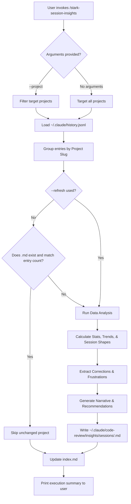

# stark-session-insights

Analyze Claude Code session history to extract usage patterns, skill invocations, action frequencies, corrections, and preferences — grouped by project. Reads ~/.claude/history.jsonl and generates per-project insight files. Use when the user says "session insights", "analyze sessions", "usage patterns", "what do I do most", or invokes /stark-session-insights.

## Workflow Overview

## When to Use

Analyze Claude Code session history to extract usage patterns, skill invocations, action frequencies, corrections, and preferences — grouped by project. Reads ~/.claude/history.jsonl and generates per-project insight files. Use when the user says "session insights", "analyze sessions", "usage patterns", "what do I do most", or invokes /stark-session-insights.

## Prerequisites

*See SKILL.md*

## Arguments

`[--project <name>] [--refresh]`

## Quick Start

/stark-session-insights

## Common Patterns

## Troubleshooting

## Related Skills

