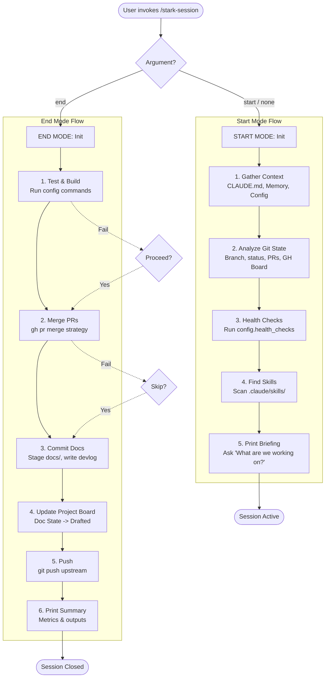
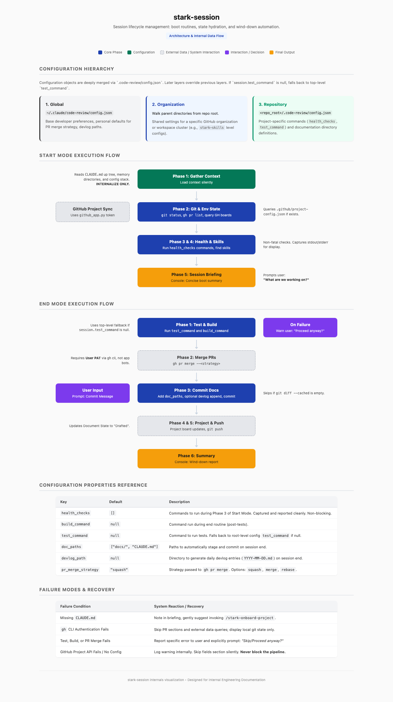

# stark-session — Internals

Session management — start and end modes. Start: loads context, git state, health checks, briefing. End: runs tests, merges PRs, commits docs, pushes. Config via .code-review/config.json hierarchy. Use when the user says "session start", "session end", "start session", "end session", "what was I working on", "catch me up", or invokes /stark-session.

## Architecture

## Phases

*See SKILL.md*

## Config

*No config*

## Failure Modes

*See SKILL.md*

## How to Modify This Skill

Edit `skill/stark-session/SKILL.md`, then run `/stark-generate-docs --skill stark-session` to regenerate documentation.
