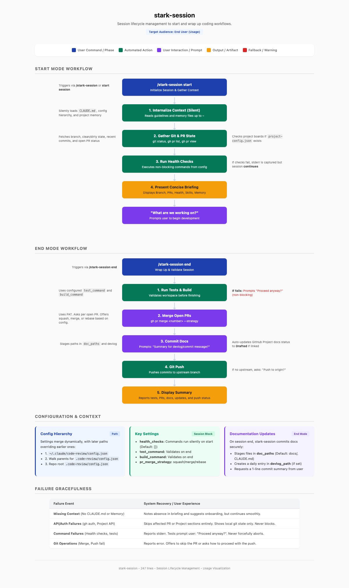

# stark-session

Session management — start and end modes. Start: loads context, git state, health checks, briefing. End: runs tests, merges PRs, commits docs, pushes. Config via .code-review/config.json hierarchy. Use when the user says "session start", "session end", "start session", "end session", "what was I working on", "catch me up", or invokes /stark-session.

## Workflow Overview

```mermaid
graph TD
  subgraph Start Mode
    StartCMD([/stark-session start]) --> LoadContext[Internalize CLAUDE.md & Config]
    LoadContext --> GitState[Gather Git & PR State]
    GitState --> ProjBoard[Check Project Board]
    ProjBoard --> HealthChecks[Run Health Checks]
    HealthChecks --> Briefing[/Display Concise Briefing/]
    Briefing --> PromptStart{{Ask: What are we working on?}}
  end

  subgraph End Mode
    EndCMD([/stark-session end]) --> RunTests[Run Tests & Build]
    RunTests -->|Fails| AskProceed{{Ask: Proceed anyway?}}
    AskProceed -->|Yes| MergePR[Merge Open PRs]
    RunTests -->|Passes| MergePR
    MergePR --> CommitDocs[Stage Docs & Devlog]
    CommitDocs --> PromptMsg{{Ask: Commit Summary?}}
    PromptMsg --> Commit[git commit]
    Commit --> UpdateProj[Update Project Field to Drafted]
    UpdateProj --> Push[Git Push]
    Push --> Summary[/Display Session Summary/]
  end
```

## When to Use

Session management — start and end modes. Start: loads context, git state, health checks, briefing. End: runs tests, merges PRs, commits docs, pushes. Config via .code-review/config.json hierarchy. Use when the user says "session start", "session end", "start session", "end session", "what was I working on", "catch me up", or invokes /stark-session.

## Prerequisites

*See SKILL.md*

## Arguments

`[start|end]`

## Quick Start

/stark-session

## Common Patterns

## Troubleshooting

## Related Skills

