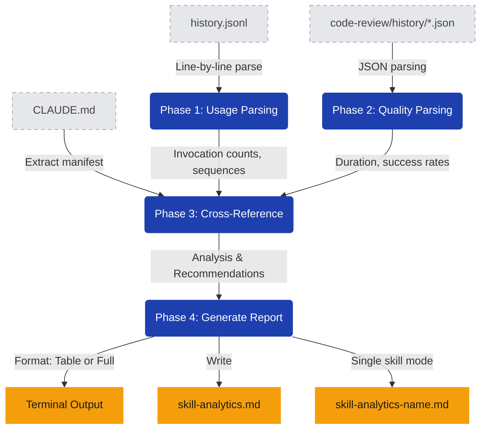

# stark-skill-analytics — Internals

Analyze skill usage patterns and quality metrics across all Claude Code sessions. Reads ~/.claude/history.jsonl and skill run history files to produce adoption curves, usage rankings, quality signals, and recommendations. Use when the user says "skill analytics", "skill usage", "which skills are used", "adoption metrics", or invokes /stark-skill-analytics.

## Architecture

## Phases

*See SKILL.md*

## Config

*No config*

## Failure Modes

*See SKILL.md*

## How to Modify This Skill

Edit `skill/stark-skill-analytics/SKILL.md`, then run `/stark-generate-docs --skill stark-skill-analytics` to regenerate documentation.
