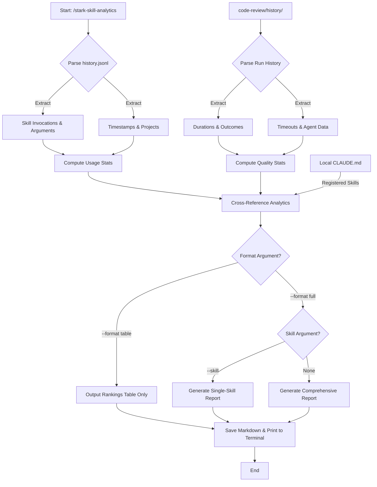

# stark-skill-analytics

Analyze skill usage patterns and quality metrics across all Claude Code sessions. Reads ~/.claude/history.jsonl and skill run history files to produce adoption curves, usage rankings, quality signals, and recommendations. Use when the user says "skill analytics", "skill usage", "which skills are used", "adoption metrics", or invokes /stark-skill-analytics.

## Workflow Overview

## When to Use

Analyze skill usage patterns and quality metrics across all Claude Code sessions. Reads ~/.claude/history.jsonl and skill run history files to produce adoption curves, usage rankings, quality signals, and recommendations. Use when the user says "skill analytics", "skill usage", "which skills are used", "adoption metrics", or invokes /stark-skill-analytics.

## Prerequisites

*See SKILL.md*

## Arguments

`[--skill <name>] [--format table|full]`

## Quick Start

/stark-skill-analytics

## Common Patterns

## Troubleshooting

## Related Skills

