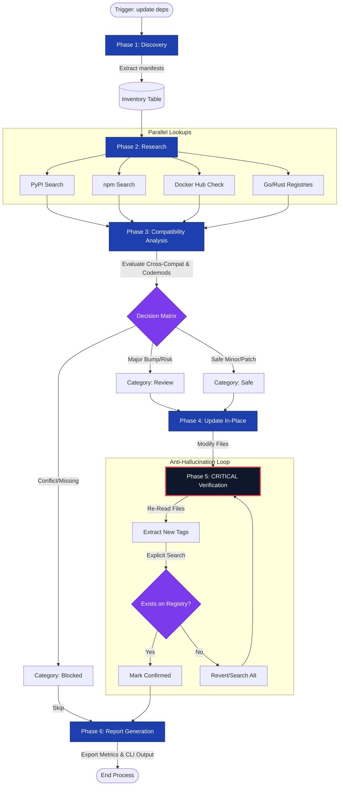

# stark-update-deps — Internals

Audit and update all dependency versions across a project to their latest stable releases. Scans pyproject.toml, package.json, requirements.txt, Dockerfile, docker-compose.yml, go.mod, Cargo.toml, and any other dependency manifest. Looks up each dependency on official sources (PyPI, npm, Docker Hub, GitHub releases) via WebSearch, checks for compatibility blockers and breaking changes, updates versions in-place, then re-verifies every updated version to ensure accuracy. Use when the user says "update dependencies", "check for outdated packages", "upgrade versions", "are my deps current", "stark-update-deps", or any variation of wanting to bring project dependencies up to date. Also use proactively when you notice stale or outdated versions during other work.

## Architecture

## Phases

*See SKILL.md*

## Config

*No config*

## Failure Modes

*See SKILL.md*

## How to Modify This Skill

Edit `skill/stark-update-deps/SKILL.md`, then run `/stark-generate-docs --skill stark-update-deps` to regenerate documentation.
