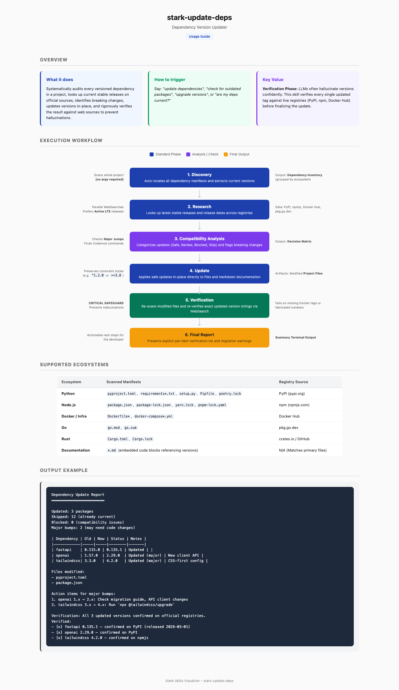

# stark-update-deps

Audit and update all dependency versions across a project to their latest stable releases. Scans pyproject.toml, package.json, requirements.txt, Dockerfile, docker-compose.yml, go.mod, Cargo.toml, and any other dependency manifest. Looks up each dependency on official sources (PyPI, npm, Docker Hub, GitHub releases) via WebSearch, checks for compatibility blockers and breaking changes, updates versions in-place, then re-verifies every updated version to ensure accuracy. Use when the user says "update dependencies", "check for outdated packages", "upgrade versions", "are my deps current", "stark-update-deps", or any variation of wanting to bring project dependencies up to date. Also use proactively when you notice stale or outdated versions during other work.

## Workflow Overview

```mermaid
graph TD
  A([Trigger: "update dependencies"]) --> B[Phase 1: Discovery]
  B --> C[Phase 2: Research & Parallel WebSearch]
  C --> D{Phase 3: Compatibility Analysis}
  
  D -->|Safe / Review| E[Phase 4: Update Files]
  D -->|Blocked / Skip| F[Leave Unchanged]
  
  E --> G{Phase 5: Strict Verification}
  G -->|Found on Registry| H[Phase 6: Final Report]
  G -->|Hallucination / Not Found| I[Revert / Re-Search]
  I --> G
  F --> H
  
  H --> J([End Process])
```



## When to Use

Audit and update all dependency versions across a project to their latest stable releases. Scans pyproject.toml, package.json, requirements.txt, Dockerfile, docker-compose.yml, go.mod, Cargo.toml, and any other dependency manifest. Looks up each dependency on official sources (PyPI, npm, Docker Hub, GitHub releases) via WebSearch, checks for compatibility blockers and breaking changes, updates versions in-place, then re-verifies every updated version to ensure accuracy. Use when the user says "update dependencies", "check for outdated packages", "upgrade versions", "are my deps current", "stark-update-deps", or any variation of wanting to bring project dependencies up to date. Also use proactively when you notice stale or outdated versions during other work.

## Prerequisites

*See SKILL.md*

## Arguments

`(no args — auto-discovers all dependency manifests)`


## Quick Start

/stark-update-deps

## Common Patterns


## Troubleshooting


## Related Skills


