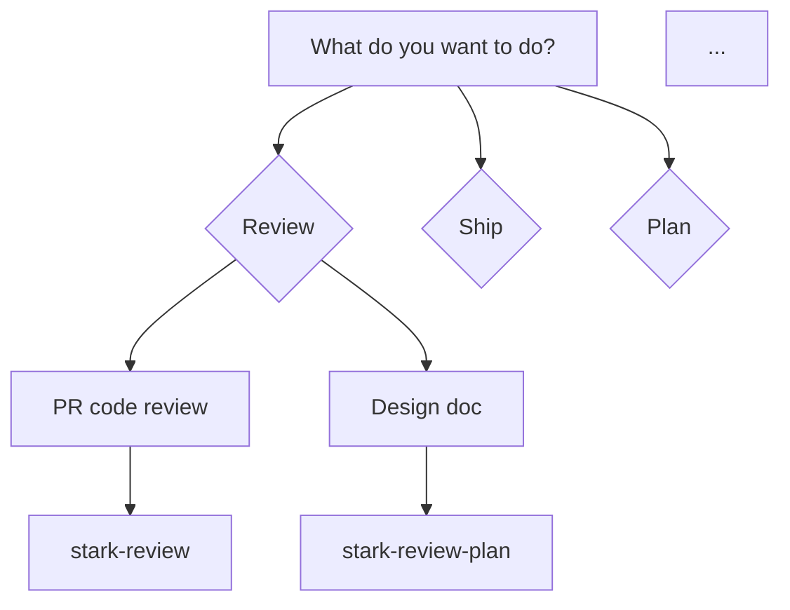

# Skill Documentation & Visualization System — Design Spec

## Problem

stark-skills has 19 skills with SKILL.md files that are dense, technical, and written for LLM consumption. Human engineers at Evinced who want to use or contribute to these skills have no accessible documentation, no visual aids, and no way to discover which skill fits their task.

## Solution

A documentation generation system that produces:
1. A **routing guide** (`README.md`) mapping tasks to skills with Mermaid decision trees
2. Two **markdown docs per skill** (usage + internals) with inline Mermaid diagrams
3. **Rich HTML visualizations** per skill rendered to PNG via Playwright, embedded alongside the Mermaid diagrams

Visualizations are generated through a 3-LLM competition (Claude, Codex, Gemini) with single-judge evaluation, mirroring the multi-agent pattern used in `multi_review.py`.

## Audiences

| Doc type | Audience | Focus |
|----------|----------|-------|
| **Routing guide** (`README.md`) | All engineers | "I want to do X — which skill?" Decision trees, task mapping |
| **Usage guide** (`usage.md`) | All engineers | When to use, prerequisites, how to invoke, common patterns, troubleshooting |
| **Internals guide** (`internals.md`) | Skill contributors | Workflow phases, config schema, failure modes, how to modify |

## Architecture

### Pipeline Overview

```
SKILL.md files
    ↓
[Parser] — extract frontmatter + complexity, pass raw markdown
    ↓
[3 LLMs] × 2 audiences — each generates standalone HTML visualization
    ↓
[Single judge] — Claude evaluates all 3 HTMLs via PNG screenshots on 6 factors
    ↓
[Winner selection] — highest weighted score wins
    ↓
[Playwright] — HTML → PNG screenshot (winner only, if not already captured)
    ↓
[Doc generator] — assemble markdown with Mermaid diagrams + embedded PNGs
    ↓
docs/skills/{skill-name}/usage.md + internals.md
```

### File Layout

```
stark-skills/
├── scripts/
│   └── generate_skill_docs.py    # Main orchestrator
├── docs/
│   └── skills/
│       ├── _audit/
│       │   └── scores.jsonl      # Scoring audit trail
│       ├── _css/
│       │   └── design-system.css # Shared CSS (embedded in each HTML)
│       ├── _manifest.json        # Staleness hashes (SKILL.md + CSS + script version)
│       ├── README.md             # Routing guide: task → skill decision trees
│       ├── index.md              # Index page linking all skills
│       ├── stark-review/
│       │   ├── usage.html        # Winning viz (user audience)
│       │   ├── usage.png         # Screenshot
│       │   ├── usage.md          # User guide: Mermaid diagrams + PNG embed
│       │   ├── internals.html    # Winning viz (contributor audience)
│       │   ├── internals.png     # Screenshot
│       │   └── internals.md      # Internals guide: Mermaid diagrams + PNG embed
│       └── ... (19 skills)
├── .gitattributes                # Git LFS for docs/skills/**/*.png
```

### Parser (Lightweight)

The parser extracts minimal structured data. The heavy lifting is done by the LLMs, which receive the raw SKILL.md alongside the structured fields.

```python
@dataclass
class SkillData:
    name: str              # From directory name
    description: str       # From YAML frontmatter
    argument_hint: str     # From YAML frontmatter
    complexity: str        # simple (<100 lines), medium (100-400), complex (>400)
    line_count: int        # Actual line count
    raw_md: str            # Full SKILL.md text — LLMs use this as primary input

    def to_json(self) -> str:
        return json.dumps(asdict(self), indent=2)
```

The parser does NOT attempt to regex-extract phases, config tables, failure modes, or arguments from the wildly varying SKILL.md formats. The LLMs are better at understanding unstructured markdown than a regex parser.

### 3-LLM Competition

Each LLM receives:
1. The `SkillData` as JSON (including full `raw_md`)
2. The shared CSS design system
3. A prompt specifying the target audience (usage vs internals)
4. Instructions to generate a standalone HTML page using the shared CSS classes

The prompt template asks for:
- **Usage audience**: workflow overview diagram, invocation examples, decision tree ("when to use this vs that"), expected output preview, prerequisites
- **Internals audience**: phase flow diagram, config schema visualization, failure mode map, data flow between components

Each LLM may also use its own inline styles alongside the shared CSS — the CSS provides a consistent foundation, not a straitjacket. This allows visual differentiation in the competition.

### Evaluation: Single-Judge on Screenshots

**Why not cross-evaluation:** LLMs cannot visually evaluate HTML from source code — they have no rendering engine. Cross-eval of raw HTML produces noisy scores driven by tag structure, not visual quality. It also doubles the LLM call count for marginal benefit.

**Approach:** After all 3 HTML files are generated, Playwright screenshots all 3. Claude (strongest at visual reasoning) evaluates the 3 PNG screenshots side-by-side on 6 factors.

6 factors, 1-10 scale:

| # | Factor | Weight | Rubric |
|---|--------|--------|--------|
| 1 | Visual Clarity | 1.0 | Workflow understandable at a glance without reading text |
| 2 | Completeness | 1.0 | All phases, failure modes, and edge cases represented |
| 3 | Information Architecture | 1.0 | Logical grouping, hierarchy, natural reading flow |
| 4 | Accuracy | 1.5 | Faithful to SKILL.md — nothing invented, nothing omitted |
| 5 | Design Quality | 0.5 | Professional styling, consistent visual hierarchy |
| 6 | Audience Fit | 1.5 | Right complexity for target audience (the whole point of the system) |

Accuracy and Audience Fit both weighted 1.5× — accuracy because wrong diagrams are harmful, audience fit because that's the system's raison d'être.

**Quality floor:** If the winning score is below 5.0/10, the skill is marked as "needs-human-review" in the manifest and a warning is printed. The output is still generated (something is better than nothing) but the manifest tracks that it's subpar.

**Tie-breaking:** Highest Accuracy score wins. If still tied, random selection (no alphabetical bias).

### Audit Trail

`docs/skills/_audit/scores.jsonl` — append-only, one JSON line per generation:

```json
{
  "skill": "stark-review",
  "audience": "usage",
  "timestamp": "2026-03-24T14:30:00Z",
  "manifest_hash": "abc123",
  "scores": {
    "claude": {"visual_clarity": 8, "completeness": 9, "info_architecture": 8, "accuracy": 9, "design_quality": 7, "audience_fit": 8, "weighted_avg": 8.42},
    "codex": {"...": "..."},
    "gemini": {"...": "..."}
  },
  "judge": "claude",
  "winner": "gemini",
  "winner_score": 8.42,
  "quality_flag": "ok"
}
```

### Shared CSS Design System

Adapted from `infra-ai-platform/scripts/generate-viz.py`'s `DESIGN_CSS`. Provides a foundation:
- Node types: `.node-phase`, `.node-decision`, `.node-failure`, `.node-config`, `.node-output`
- Flow arrows, card grids, data tables, tags
- Color palette: blue (phases), green (success), amber (warnings), red (failures), purple (config)
- Responsive, standalone (no external deps)

LLMs embed the CSS inline and may extend it with additional inline styles. The CSS is a floor, not a ceiling.

### Staleness Detection

`docs/skills/_manifest.json` stores hashes of all inputs that affect output:

```json
{
  "meta": {
    "css_hash": "abc123",
    "script_version": "1.0.0"
  },
  "skills": {
    "stark-review": {
      "hash": "def456",
      "usage_quality": "ok",
      "internals_quality": "ok"
    },
    "stark-session": {
      "hash": "789abc",
      "usage_quality": "needs-human-review",
      "internals_quality": "ok"
    }
  }
}
```

`--check` mode: exit 1 if any SKILL.md hash changed, CSS changed, or script version bumped since last generation.

Skills with any audience flagged `needs-human-review` are always treated as stale and regenerated.

### LLM Output Format

Each LLM produces three artifacts per skill×audience (returned in a structured response):

1. **HTML visualization** — standalone page using the shared CSS
2. **Mermaid diagram** — workflow/architecture diagram for inline markdown embedding
3. **Structured doc content** — JSON with section content for the markdown template:

```json
{
  "prerequisites": "Requires `gh` CLI authenticated, ...",
  "arguments_table": "| Arg | Default | Description |\n|...",
  "quick_start": "/stark-review 42",
  "common_patterns": "- Review before merge: ...",
  "troubleshooting": "- Auth fails: run `gh auth login`\n- ...",
  "related_skills": ["stark-pr-flow", "stark-review-plan"],
  "phase_walkthrough": "### Phase 1: Setup\n...",
  "config_schema": "| Key | Default | Notes |\n|...",
  "failure_modes": "| Failure | Recovery |\n|...",
  "how_to_modify": "Edit SKILL.md, run /stark-generate-docs, test via ..."
}
```

All three artifacts are persisted to disk per skill×audience:
- `{skill}/{audience}.html` — winning HTML
- `{skill}/{audience}.mermaid` — winning Mermaid diagram
- `{skill}/{audience}.json` — winning structured doc content

This enables `--markdown-only` to rebuild from disk without LLM calls.

### Markdown Doc Generation

After viz selection, the script generates markdown docs from the persisted artifacts. Each doc includes both **Mermaid diagrams** (searchable, accessible, render natively on GitHub) and **PNG embeds** (rich visual detail).

**usage.md template:**
- Title, one-line description
- "When to Use" — trigger phrases from frontmatter description
- Mermaid workflow overview diagram (from `usage.mermaid`)
- Rich visualization PNG embed (with descriptive alt text from LLM, not just skill name)
- Prerequisites (from `usage.json.prerequisites`)
- Arguments table (from `usage.json.arguments_table`)
- Quick start example (from `usage.json.quick_start`)
- Common patterns (from `usage.json.common_patterns`)
- Troubleshooting (from `usage.json.troubleshooting`)
- Related skills (from `usage.json.related_skills`)

**internals.md template:**
- Title, architecture summary
- Mermaid phase flow diagram (from `internals.mermaid`)
- Rich visualization PNG embed (with descriptive alt text)
- Phase-by-phase walkthrough (from `internals.json.phase_walkthrough`)
- Config schema table (from `internals.json.config_schema`)
- Failure modes table (from `internals.json.failure_modes`)
- Dependencies
- Observability metrics
- How to modify this skill (from `internals.json.how_to_modify`)

### Routing Guide (`docs/skills/README.md`)

A hand-structured, LLM-populated decision tree mapping tasks to skills:

```markdown
## I want to...

### Review code
- Review a PR with multiple AI agents → `/stark-review`
- Review a design doc or spec → `/stark-review-plan`
- Review an infrastructure/deployment plan → `/stark-review-deployment-plan`
- Improve review prompts based on feedback → `/stark-review-improvement`

### Ship code
- Create PR, review, and merge end-to-end → `/stark-pr-flow`
- Just cut a release → `/stark-release`
...
```

With Mermaid decision tree:



### CLI Interface

```bash
python scripts/generate_skill_docs.py                          # all skills
python scripts/generate_skill_docs.py --skill stark-review     # one skill
python scripts/generate_skill_docs.py --check                  # staleness check (CI)
python scripts/generate_skill_docs.py --no-screenshots         # skip PNG generation
python scripts/generate_skill_docs.py --no-evaluation          # generate only, skip judge
python scripts/generate_skill_docs.py --markdown-only          # skip LLM, regen markdown
python scripts/generate_skill_docs.py --dry-run                # show what would change
python scripts/generate_skill_docs.py --force                  # regenerate even if manifest is clean
python scripts/generate_skill_docs.py --all                    # alias for --force
```

### Skill for Future Updates

A new skill `/stark-generate-docs` that:
1. Detects which SKILL.md files have changed (manifest check)
2. Runs `generate_skill_docs.py` for all changed skills in one invocation
3. Commits the updated docs + PNGs
4. Can be wired into `/stark-pr-flow` as a pre-PR step

### Concurrency Model

**Single flat ThreadPoolExecutor** — no nested pools. All LLM calls (generation + evaluation) are submitted to one pool.

- Generation: 3 LLMs × 2 audiences × N skills = 6N tasks
- Evaluation: 1 judge × 2 audiences × N skills = 2N tasks (sequential after generation per skill)
- `MAX_WORKERS = 6` — 2 skills × 3 LLMs at a time. Avoids rate limits on all 3 providers.
- Same retry/timeout/fallback logic as multi_review.py

Total LLM calls per full run: 6N (generation) + 2N (evaluation) = 8 × 19 = **152 calls**.
Per-skill regeneration: 6 (generation) + 2 (evaluation) = **8 calls**.

### HTML Validation & Sanitization

Before evaluation/screenshot, sanitize and validate each generated HTML:

**Sanitization (applied automatically):**
1. Strip all `<script>` tags and content (use `html.parser`, not regex — regex is bypassable with malformed tags)
2. Strip all `on*` event handler attributes (`onload`, `onerror`, `onmouseover`, etc.)
3. Strip `<iframe>`, `<object>`, `<embed>`, `<meta>` tags
4. Strip CSS `url()` and `@import` declarations

**Validation (after sanitization):**
1. Must contain `<html>` and `</html>`
2. Must not reference external resources — reject URLs in `src=`, `href=`, `url(`, `@import` attributes matching `https?://`, `//`, `data:`, `javascript:`, `file:` schemes. Plain text or comment URLs are harmless and allowed.
3. Must contain at least one CSS class from the design system

**Playwright hardening:**
- Render with `--disable-javascript` flag
- Block all network requests: `page.route('**', route => route.abort())`
- These neutralize any remaining execution/exfiltration vectors regardless of HTML content

Invalid HTML = disqualified, logged to audit.

### Error Handling

| Failure | Recovery |
|---------|----------|
| LLM returns empty output | Retry once, then disqualified |
| LLM returns invalid HTML | Sanitize first, re-validate. If still invalid, disqualified |
| All 3 LLMs fail for a skill | Log error, skip skill, mark as "failed" in manifest |
| 2 of 3 LLMs fail | Skip evaluation, use the sole survivor with `quality: "degraded"` |
| 2 of 3 LLMs succeed | Judge evaluates 2 candidates instead of 3 |
| Playwright not installed | Skip screenshots, markdown embeds "view .html" link instead of PNG |
| SKILL.md parse failure | Use raw text only (frontmatter defaults to directory name) |
| Winning score < 5.0/10 | Publish but mark as `quality: "needs-human-review"` |
| Tie scores | Break by Accuracy, then random |

### Binary Artifact Management

PNG files are tracked via **Git LFS** to prevent repo bloat:

```gitattributes
docs/skills/**/*.png filter=lfs diff=lfs merge=lfs -text
```

HTML files are committed normally (text, diffable).

## Scope

**In scope:**
- Lightweight parser for SKILL.md → frontmatter + raw markdown
- 3-LLM HTML generation with shared CSS (extensible by LLMs)
- Single-judge evaluation on PNG screenshots
- Playwright HTML → PNG conversion
- Markdown doc generation with Mermaid diagrams + PNG embeds
- Routing guide (README.md) with decision trees
- Staleness manifest tracking SKILL.md + CSS + script version
- Audit trail (scores.jsonl)
- HTML validation + `<script>` stripping
- Git LFS for PNGs
- `/stark-generate-docs` skill for ongoing maintenance
- Index page

**Out of scope:**
- MkDocs or other doc site — just markdown + PNGs that render on GitHub
- Automated PR creation for doc updates (use `/stark-pr-flow` manually)
- Translation / i18n
