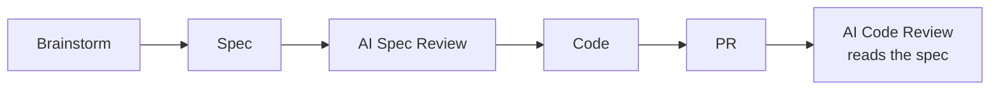

# Dev Docs Management System

A lightweight standard for engineering teams who want their AI code reviews to actually understand the code — and want their docs to stop going stale unnoticed.

This isn't a documentation process. It's a pipeline that connects your design decisions to your code reviews, automatically.

---

## What You Get

- AI reviewers (Claude, Codex, Gemini) that read your spec before reviewing the PR — not just the diff
- A PR template that takes 2 seconds to fill out and makes reviews 10x more useful
- Stale doc detection on every PR (warns, never blocks)
- ADRs that explain the "why" behind surprising choices — permanently
- One command to set up the full structure in any repo

---

## The Pipeline



The spec link in the PR description is what closes the loop. The AI reviewer fetches and reads it before saying a word about the code.

---

## How to Adopt

**New repo — scaffold the structure:**

```
/init-docs --template
```

Creates the directory layout, ADR template, PR template, mkdocs.yml, and staleness config. No content generated. Safe to run on existing repos — idempotent.

**Existing repo — generate docs from history:**

```
/init-docs --backfill
```

Reads git log and merged PRs. Infers ADRs from technology choices, drafts specs from significant PRs, generates guides from CI configs and scripts. Commits everything.

**Existing docs — migrate into the standard layout:**

```
/init-docs --upgrade
```

Scans for docs anywhere in the repo, classifies and moves them into the standard structure using `git mv` to preserve history.

---

## Repo Structure

After running `/init-docs --template`, you get:

```
docs/
  specs/          # YYYY-MM-DD-slug.md
  plans/          # YYYY-MM-DD-slug.md
  adr/            # NNNN-slug.md (immutable once accepted)
  guides/         # living how-to docs and runbooks
  reference/      # API docs, config reference
  architecture/   # system diagrams, C4 models
mkdocs.yml
.github/pull_request_template.md
.doc-staleness.yml
```

---

## Templates

- [Pull Request Template](templates/pull_request_template.md) — one field: the spec link
- [ADR Template](templates/adr-template.md) — context, decision, alternatives, consequences

---

## What Gets Checked for Staleness

The GitHub Action runs on every PR and warns (never blocks) when living docs haven't been touched in 3+ months.

Checked: `guides/`, `reference/`, `architecture/`
Skipped: `adr/` (immutable), `specs/`, `plans/` (point-in-time artifacts)

Configure the threshold in `.doc-staleness.yml`.

---

## What This Is Not

It doesn't replace Confluence for cross-functional or compliance docs. It doesn't enforce docs via hard CI gates. It doesn't add a review process — it makes the review process you already have much better.
