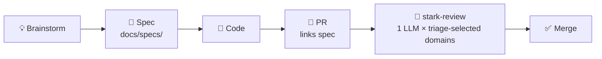

# __REPO_NAME__

> New here? Start with `docs/specs/`. Confused about a decision? Check `docs/adr/`. Need to ship? See [the pipeline](#pipeline).

---

## Pipeline

Every feature goes through this flow. Skip a step and the AI reviewer will flag it.



**The rule:** PR description must link the spec. No spec = review agents work blind.

---

## Quick Commands

```bash
# Serve docs locally
mkdocs serve

# Create a new ADR
cp docs/adr/template.md docs/adr/$(printf "%04d" $(ls docs/adr/*.md | wc -l))-your-title.md

# Create a new spec
touch docs/specs/your-feature.md

# Run AI review on a PR
/stark-review <PR_NUMBER>
```

---

## What Lives Where

| Path | Purpose |
|------|---------|
| `docs/specs/` | Feature specs — written before code |
| `docs/plans/` | Implementation plans — how, not what |
| `docs/adr/` | Architecture Decision Records — why |
| `docs/guides/` | How-to guides for humans |
| `docs/reference/` | API / config reference |
| `docs/architecture/` | System diagrams, component maps |

---

## Decisions

Major technical choices are in `docs/adr/`. If something feels arbitrary, there's probably a record. Search there first before re-litigating.

---

## Specs

Browse all specs under `docs/specs/`. Each spec is a single markdown file, named after the feature. Link to it from your PR.

A spec needs: **what** you're building, **why**, and **what you're explicitly not building**. Everything else is optional.

---

## Contributing

Write docs in the same PR as the code. Docs written after the fact drift. The staleness checker at `.github/workflows/doc-staleness.yml` will surface files that haven't been touched in 90 days.
